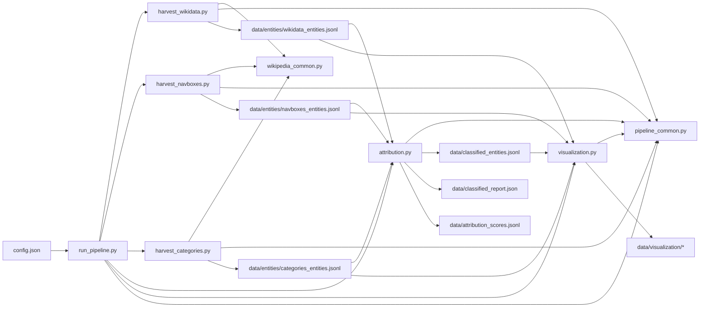

# Conflict Entity Pipeline v2 (Config-Driven)

This folder provides a config-driven pipeline for conflict entity harvesting and attribution.

## What this version adds

- Uses one `config.json` to control parties, languages, navboxes, and categories.
- Splits harvesting into 3 scripts:
  - `harvest_wikidata.py`
  - `harvest_navboxes.py`
  - `harvest_categories.py`
- Uses one attribution script:
  - `attribution.py`
- Keeps one unified JSONL schema across all harvest outputs.
- Moves the original `ru_ua_*` scripts into `ru_ua_only/` for backward compatibility.

## Files

- `config.json`: main manual research config.
- `pipeline_common.py`: shared helpers (schema normalization, merge, IO).
- `wikipedia_common.py`: shared Wikipedia/API/navbox/category helper functions.
- `harvest_wikidata.py`: Wikidata SPARQL harvest.
- `harvest_navboxes.py`: harvest from configured navbox titles.
- `harvest_categories.py`: BFS/DFS category harvest.
- `attribution.py`: classify into `party1 | party2 | mixed | other`.
- `visualization.py` (optional): overlap + attribution summary report and figures.
- `run_pipeline.py`: one-command runner (reads all paths/switches from config).

## Workflow overview



- `run_pipeline.py` decides which steps to run and in what order.
- `wikipedia_common.py` provides shared Wikipedia crawling and parsing utilities for the harvest scripts.
- `pipeline_common.py` provides shared schema normalization, IO, merge, logging, and Wikidata enrichment utilities.
- The three harvesters write source-level outputs into `data/entities/*.jsonl`.
- `attribution.py` merges those harvested entities and assigns `party1 | party2 | mixed | other`.
- `visualization.py` reads both the classified output and the source outputs to produce figures and reports.

## Unified JSONL schema (all harvesters)

Each record is normalized to:

- `qid`
- `uri`
- `source`:
  - `type`
  - `page`
  - `hint`
  - `collection_paths`
- `labels`: `{<lang>: ...}` (langs from `config.languages.all`)
- `descriptions`: `{<lang>: ...}`
- `aliases`: `{<lang>: [...]}` 
- `sitelinks`: `{<lang>wiki: ...}`
- `wiki_titles`: `{<lang>: ...}`
- `instance_of`: `[]`
- `raw_attrib_qids`:
  - `P27, P17, P495, P159, P131, P276, P19, P740, P551`

This guarantees all generated JSONL files can be merged/classified consistently.

## Config format

`config.json` is researcher-authored and should look like this (example included in this folder):

```json
{
  "conflicting_parties": {
    "party1": {"ID": "Q159", "label": "Russia", "allies": ["Q16150196", "Q16746854"]},
    "party2": {"ID": "Q212", "label": "Ukraine", "allies": []}
  },
  "languages": {
    "all": ["en", "ru", "uk"],
    "party1": "ru",
    "party2": "uk",
    "party3": "en"
  },
  "navbox_names": ["Russo-Ukrainian war", "Russo-Ukrainian war (2022-present)"],
  "category_names": ["Russo-Ukrainian war"],
  "categories": {
    "source_lang": "en",
    "langs": ["en", "ru", "uk"],
    "depth": 1,
    "strategy": "bfs",
    "use_keyword_filter": true
  }
}
```

Optional sections are also supported:

- `navbox_seed_url`
- `categories` (`source_lang`, `langs`, `depth`, `strategy`, `use_keyword_filter`, `keywords`, `keywords_by_lang`)
- `wikidata` (`seed_qids`, `seed_from_navbox_page`, `limit`, `no_aliases`, `aliases`, `ensure_qids`, `type_anchors`, `relation_properties`, `bucket_queries`)
- `harvest_hints` (`instance_of_map` for source hint labels)
- `visualization` (`language_order`, `attribution_display_names`, `source_display_names`, `entity_files`, `venn`)
- `classification` (`other_threshold`, `report_label_lang`, `attribution_properties`, `place_country_resolution`, `other_country_hints`, `other_country_text_map`, `party1_patterns`, `party2_patterns`, `other_patterns`, `output_labels`, `legacy_output`)
- `pipeline` (`run`, `paths`, `logging`) for one-command pipeline execution and shared logs

Category expansion depth is config-first:
- default is `categories.depth = 1`
- to expand to subcategories further, edit only `config.json` (no command change needed)

Wikidata harvesting is now conflict-agnostic:
- no hardcoded Russo-Ukrainian QIDs in `harvest_wikidata.py`
- seeds come from config (`wikidata.seed_qids`) and/or auto-resolve from `navbox_seed_url`

### Inline config notes

`config.json` now includes a top-level `_help` block with per-section notes:
- default values
- what each field controls
- how to tune it

This block is documentation-only. Scripts ignore it.

### Regex patterns in config (recommended)

Country attribution text patterns are defined in `config.json` under:
- `classification.party1_patterns`
- `classification.party2_patterns`
- `classification.other_patterns`
- `classification.other_country_text_map` (regex-to-country-QID mapping for `other` country guessing)

Each is a map of language code to a list of regex strings, for example:

```json
{
  "classification": {
    "other_country_hints": ["Q30", "Q148", "Q183"],
    "other_country_text_map": [
      {"pattern": "united states|american|u\\.?s\\.?", "qid": "Q30"},
      {"pattern": "\\bchina\\b|\\bchinese\\b|\\bprc\\b", "qid": "Q148"}
    ],
    "party1_patterns": {"en": ["\\\\brussia\\\\b"], "ru": ["\\\\bросси"], "uk": ["\\\\bросі"]},
    "party2_patterns": {"en": ["\\\\bukrain"], "ru": ["\\\\bукраин"], "uk": ["\\\\bукраїн"]},
    "other_patterns": {"en": ["\\\\bunited states\\\\b"], "ru": ["\\\\bкита"], "uk": ["\\\\bкита"]}
  }
}
```

This design keeps conflict-specific customization in `config.json` rather than hardcoded in Python.

Location-to-country inference in `attribution.py` is also config-driven now:
- `classification.place_country_resolution.country_property` (default `P17`)
- `classification.place_country_resolution.admin_property` (default `P131`)
- `classification.place_country_resolution.max_admin_depth` (default `3`)
- `classification.place_country_resolution.place_properties` (which raw place-like props to scan)

Structured scoring properties are configurable too:
- `classification.attribution_properties`

Wikidata bucket internals are configurable too:
- `wikidata.type_anchors`
- `wikidata.relation_properties`
- `wikidata.bucket_queries` (optional full custom WHERE blocks; supports `{seed_values}` placeholder)

Alias enrichment is configurable too:
- `wikidata.aliases.enabled`
- `wikidata.aliases.max_total_per_qid`
- `wikidata.aliases.max_per_lang`

### Named output labels in classification

`attribution.py` always writes the generic label field:
- `attribution` in `{party1, party2, mixed, other}`

By default it also writes country-named labels via config:
- `classification.output_labels.enabled = true` (default in template config)
- field name is `classification.output_labels.field_name` (default: `country_attribution`)
- `party1`/`party2` names are taken from `conflicting_parties.party1.label` and `conflicting_parties.party2.label` unless overridden

For backward compatibility with old pipelines, you can also enable:
- `classification.legacy_output.enabled = true`
- choose legacy field with `classification.legacy_output.field_name`

## Install

```bash
cd "/Users/yuanyu/Desktop/Russia_Ukrain_War/pipeline_v2"
python3 -m venv .venv
source .venv/bin/activate
pip install -r requirements.txt
pip install lxml numpy matplotlib matplotlib-venn
```

If you already use your existing environment, you can skip creating `.venv` and run:

```bash
source "/Users/yuanyu/Desktop/Russia_Ukrain_War/ru_ua/bin/activate"
pip install -r requirements.txt
```

## Run pipeline

Two equivalent ways are supported:
- **Option A**: run everything with one command (`run_pipeline.py`).
- **Option B**: run each step manually (recommended for debugging/tuning).

### Option A: One-command run (config-driven)

All steps are read from `config.json`:

```bash
cd "/Users/yuanyu/Desktop/Russia_Ukrain_War/pipeline_v2"
source .venv/bin/activate
# or: source "/Users/yuanyu/Desktop/Russia_Ukrain_War/ru_ua/bin/activate"

python run_pipeline.py --config config.json
```

`run_pipeline.py` uses:
- `pipeline.run` to enable/disable each step
- `pipeline.paths` to set output paths
- `visualization.entity_files` to map source filenames inside `entities_folder`
- `pipeline.logging` to write one shared step/query log file

### Logging (harvest transparency)

The three harvesters can now write a shared log file that includes:
- step start/end messages
- SPARQL queries used
- MediaWiki API request parameters and pagination progress
- per-step output counts (titles, resolved QIDs, batches, final records)

Default config:

```json
"pipeline": {
  "logging": {
    "enabled": true,
    "file": "data/logs/harvest.log",
    "append": true,
    "log_queries": true,
    "query_max_chars": 12000
  }
}
```

Override the log path for a single harvester run:

```bash
python harvest_categories.py \
  --config config.json \
  --output data/entities/categories_entities.jsonl \
  --log-file data/logs/categories_debug.log
```

### Option B: Run each step manually

Full rerun (copy-paste):

```bash
cd "/Users/yuanyu/Desktop/Russia_Ukrain_War/pipeline_v2"
source .venv/bin/activate
# or: source "/Users/yuanyu/Desktop/Russia_Ukrain_War/ru_ua/bin/activate"

mkdir -p data/entities data/visualization

python harvest_wikidata.py \
  --config config.json \
  --output data/entities/wikidata_entities.jsonl

python harvest_navboxes.py \
  --config config.json \
  --output data/entities/navboxes_entities.jsonl

python harvest_categories.py \
  --config config.json \
  --output data/entities/categories_entities.jsonl

python attribution.py \
  --config config.json \
  --entities_folder data/entities \
  --output data/classified_entities.jsonl \
  --attribution-jsonl data/attribution_scores.jsonl \
  --report data/classified_report.json

python visualization.py \
  --config config.json \
  --entities_folder data/entities \
  --classified data/classified_entities.jsonl \
  --outdir data/visualization
```

By default, visualization also writes Venn plots from config:
- `data/visualization/venn_global.png`
- `data/visualization/venn_party1.png`
- `data/visualization/venn_party2.png`
- `data/visualization/venn_mixed.png`
- `data/visualization/venn_other.png`

You can control this in `config.json`:

```json
"visualization": {
  "venn": {
    "enabled": true,
    "global": true,
    "per_label": true,
    "source_labels": ["Wikidata", "Wikipedia navboxes", "Wikipedia categories"]
  }
}
```

Quick rerun (if `data/entities/*_entities.jsonl` already exist):

```bash
python attribution.py \
  --config config.json \
  --entities_folder data/entities \
  --output data/classified_entities.jsonl \
  --attribution-jsonl data/attribution_scores.jsonl \
  --report data/classified_report.json

python visualization.py \
  --config config.json \
  --entities_folder data/entities \
  --classified data/classified_entities.jsonl \
  --outdir data/visualization
```

### 1) Harvest from Wikidata

```bash
python harvest_wikidata.py \
  --config config.json \
  --output data/entities/wikidata_entities.jsonl
```

### 2) Run navbox harvesting

```bash
python harvest_navboxes.py \
  --config config.json \
  --output data/entities/navboxes_entities.jsonl
```

### 3) Run category harvesting (BFS)

```bash
python harvest_categories.py \
  --config config.json \
  --output data/entities/categories_entities.jsonl
```

### 4) Merge and run attribution (classification)

Recommended command (with report):

```bash
python attribution.py \
  --config config.json \
  --entities_folder data/entities \
  --output data/classified_entities.jsonl \
  --attribution-jsonl data/attribution_scores.jsonl \
  --report data/classified_report.json
```

### 5) Generate comparison + visualization (optional)

```bash
python visualization.py \
  --config config.json \
  --entities_folder data/entities \
  --classified data/classified_entities.jsonl \
  --outdir data/visualization
```

`visualization.py` display names are config-driven:
- `party1`/`party2` bars default to `conflicting_parties.party1.label`/`conflicting_parties.party2.label`
- if those labels are missing, it falls back to `languages.party1`/`languages.party2`
- language coverage chart uses `visualization.language_order` (default: `languages.all`)
- source JSONL filenames can be configured in `visualization.entity_files`
- you can override labels with:
  - `visualization.attribution_display_names`
  - `visualization.source_display_names`

Additional hint-analysis outputs are generated automatically:
- Global matrix outputs (all sources merged):
  - `data/visualization/hint_attribution_table.csv` (column-normalized)
  - `data/visualization/hint_attribution_table_row_normalized.csv` (row-normalized)
  - `data/visualization/hint_attribution_heatmap.png` (column-normalized)
  - `data/visualization/hint_attribution_heatmap_row_normalized.png` (row-normalized)
- Source-stratified matrix outputs (same logic, per source):
  - `data/visualization/hint_attribution_table_wikidata.csv`
  - `data/visualization/hint_attribution_table_wikidata_row_normalized.csv`
  - `data/visualization/hint_attribution_table_navboxes.csv`
  - `data/visualization/hint_attribution_table_navboxes_row_normalized.csv`
  - `data/visualization/hint_attribution_table_categories.csv`
  - `data/visualization/hint_attribution_table_categories_row_normalized.csv`
  - `data/visualization/hint_attribution_heatmap_wikidata.png`
  - `data/visualization/hint_attribution_heatmap_wikidata_row_normalized.png`
  - `data/visualization/hint_attribution_heatmap_navboxes.png`
  - `data/visualization/hint_attribution_heatmap_navboxes_row_normalized.png`
  - `data/visualization/hint_attribution_heatmap_categories.png`
  - `data/visualization/hint_attribution_heatmap_categories_row_normalized.png`
- Unknown-hint diagnostics:
  - `data/visualization/unknown_hint_reason_counts.png`
  - report fields under `classified.unknown_hint_analysis`

### Hint heatmap file guide

The hint-attribution heatmaps all use the same row/column layout:

- rows = final attribution labels (`party1`, `party2`, `mixed`, `other`)
- columns = harvest hints (`person`, `event`, `organization`, `policy`, `media_narrative`, `unknown`)

The filenames tell you two things:

- scope:
  - no source suffix = all sources merged together
  - `_wikidata` = Wikidata source only
  - `_navboxes` = Wikipedia navboxes source only
  - `_categories` = Wikipedia categories source only
- normalization:
  - plain filename = column-normalized
  - `_row_normalized` in the filename = row-normalized

In practice, the files mean:

- All sources merged:
  - `data/visualization/hint_attribution_heatmap.png`
    - all sources merged
    - column-normalized
  - `data/visualization/hint_attribution_heatmap_row_normalized.png`
    - all sources merged
    - row-normalized
- Wikidata only:
  - `data/visualization/hint_attribution_heatmap_wikidata.png`
    - Wikidata only
    - column-normalized
  - `data/visualization/hint_attribution_heatmap_wikidata_row_normalized.png`
    - Wikidata only
    - row-normalized
- Navboxes only:
  - `data/visualization/hint_attribution_heatmap_navboxes.png`
    - navboxes only
    - column-normalized
  - `data/visualization/hint_attribution_heatmap_navboxes_row_normalized.png`
    - navboxes only
    - row-normalized
- Categories only:
  - `data/visualization/hint_attribution_heatmap_categories.png`
    - categories only
    - column-normalized
  - `data/visualization/hint_attribution_heatmap_categories_row_normalized.png`
    - categories only
    - row-normalized

### What normalization means here

Normalization means: instead of only showing raw counts, the plot also shows percentages after rescaling counts relative to a chosen total.

- Column-normalized:
  - each hint column is treated as its own 100%
  - question answered: "within this hint type, how are final attributions distributed?"
  - example: in the `unknown` column, what share became `party1`, `party2`, `mixed`, or `other`?
- Row-normalized:
  - each attribution row is treated as its own 100%
  - question answered: "within this attribution label, where did the entities come from by hint?"
  - example: among all `mixed` entities, how many came from `person`, `event`, `organization`, or `unknown` hints?

So the two versions are intentionally different:

- column-normalized = better for checking hint purity / ambiguity
- row-normalized = better for checking attribution composition

Important naming rule:

- `...heatmap.png` means column-normalized
- `...heatmap_row_normalized.png` means row-normalized
- the same rule also applies to the CSV tables

Why each source has two figures:
- they answer two different questions, so both are kept intentionally.

Hint extraction method:
- visualization uses an `effective_hint` per entity from `source.hint` and `_sources[*].hint`
- if multiple hints exist, it prefers the most frequent non-`unknown` hint
- this is reported in `visualization_report.json` under:
  - `classified.hint_attribution.hint_extraction`

### 6) Quick output checks

```bash
ls -lh data/entities
ls -lh data/classified_entities.jsonl data/attribution_scores.jsonl data/classified_report.json
ls -lh data/visualization
```

## Label policy in attribution.py

Output labels are:

- `party1`
- `party2`
- `mixed`
- `other`

Decision rule:

- both sides evidence -> `mixed`
- only party1 evidence -> `party1`
- only party2 evidence -> `party2`
- no party1/party2 evidence:
  - default -> `other`

### Third-party country breakdown (inside `other`)

When an entity is labeled `other`, `attribution.py` also tries to guess the most likely
third-party country (best-effort) using configurable direct-country properties and
place→country inference from `classification.place_country_resolution`.

If `--report` is enabled, the report includes:
- `other_country_top3`: top 3 third-party countries inside `other` (by entity count)
- each entry has `label` + `label_lang` (configured by `classification.report_label_lang`)
- `other_country_unknown`: how many `other` entities had no country guess

### Attribution audit JSONL (new)

`attribution.py` can now also write a compact per-entity scoring file:
- `data/attribution_scores.jsonl`

Each row includes:
- `qid`
- `attribution`
- `scores` / `structured_scores` / `text_scores`
- `hits` (evidence snippets)
- `other_country_guess`
- source summary (`source_type`, `source_hint`, `collection_paths`)
- optional country-named label field (for example `country_attribution`)

In `classified_entities.jsonl`, each entity also has:
- `pre_label_scores`: scores computed before final label decision
  (`party1`, `party2`, `other`, plus `structured` and `text` subtotals)

## Debug / tuning

- Category harvest too broad:
  - lower `categories.depth` in `config.json`
  - use `--max-categories`, `--max-titles`
- Category harvest too slow:
  - keep `strategy=bfs`, `depth=1`
  - keep `use_keyword_filter=true`
  - reduce keywords scope
- Attribution too many `mixed`:
  - add stronger `party1_patterns` / `party2_patterns` in `config.json`
  - expand `classification.attribution_properties` / `classification.place_country_resolution.place_properties`

### Wikidata alias stage: progress and limits

During `harvest_wikidata.py`, you may see logs like:
- `[wikidata] alias_progress=1600/2723`
- `[sparql] failed attempt=1/3 tag=wikidata.aliases.Q...: HTTP Error 502`

Meaning:
- `alias_progress=X/N`:
  - `N` is the number of harvested QIDs to process for alias enrichment (not alias count).
  - the script queries aliases per QID, so this step can be long when `N` is large.
- `failed attempt=1/3`:
  - transient endpoint/network issue; the script retries automatically.
  - if retries still fail for a QID, aliases for that QID stay empty and the pipeline continues.

Alias caps (config-driven):
- `wikidata.aliases.max_total_per_qid`: cap total aliases saved per QID across all languages.
- `wikidata.aliases.max_per_lang`: cap aliases per language per QID.

Important:
- these caps limit aliases stored per entity, but do not reduce how many QIDs are processed.
- to speed up significantly, reduce harvested QID count (`wikidata.limit`, query scope) or disable alias enrichment (`wikidata.aliases.enabled=false` or `wikidata.no_aliases=true`).

## Why counts can drop vs legacy RU-UA runs

If you compare this config-driven v2 pipeline to the legacy RU-UA scripts, it is normal to see a much smaller merged QID set unless category settings are tuned.

Main reasons (ordered by impact):

- Legacy `ru_ua_harvest_wikipedia_navboxes.py` used a very broad category expansion in the same run as navbox extraction.
  - In a representative legacy report, `resolved_qids` reached `7394`, mostly due to wide category crawl coverage.
- In v2, sources are split (`harvest_navboxes.py`, `harvest_categories.py`, `harvest_wikidata.py`), and category crawling is intentionally more conservative by default.
- When keywords are not explicitly set, `harvest_categories.py` auto-derives lightweight keywords per language from the resolved root category titles.
  - This behavior is implemented in `harvest_categories.py` (`_auto_keywords` + per-language fallback assignment).
  - Subcategory traversal is then filtered by keyword matching in `wikipedia_common.py` (`keep_subcategory_by_keywords`).
- If keyword filtering is too strict for your conflict/languages, RU/UK (or other target languages) may still become shallow.
- `source_lang` does matter, but the strongest drivers are:
  - multilingual keyword coverage (`categories.keywords` / `categories.keywords_by_lang`)
  - whether filtering is enabled (`categories.use_keyword_filter`)
  - traversal depth (`categories.depth`)

How to recover higher recall (legacy-like breadth):

- Define explicit multilingual keywords in `config.json` under `categories.keywords` or `categories.keywords_by_lang`.
- For maximum recall, set `categories.use_keyword_filter = false`.
- Keep `categories.strategy = "bfs"` and increase `categories.depth` carefully.
- Optionally raise traversal limits (`--max-categories`, `--max-titles`) only after keyword tuning.

Example keyword block:

```json
"categories": {
  "source_lang": "en",
  "langs": ["en", "ru", "uk"],
  "depth": 1,
  "strategy": "bfs",
  "use_keyword_filter": true,
  "keywords_by_lang": {
    "en": ["russo", "ukrain", "russia", "war", "invasion"],
    "ru": ["росс", "украин", "войн", "вторж", "агресс"],
    "uk": ["росій", "україн", "війн", "вторг", "агрес"]
  }
}
```

## Backward compatibility

Legacy RU-UA-only scripts remain available in `ru_ua_only/`:

- `ru_ua_only/ru_ua_harvest_wikidata_entities.py`
- `ru_ua_only/ru_ua_harvest_wikipedia_navboxes.py`
- `ru_ua_only/ru_ua_classify_entities.py`
- `ru_ua_only/ru_ua_harvest_visual.py`

Use them only if you need exact old RU-UA outputs. The new config-driven scripts in the top-level `pipeline_v2/` folder are the conflict-agnostic v2 workflow.
